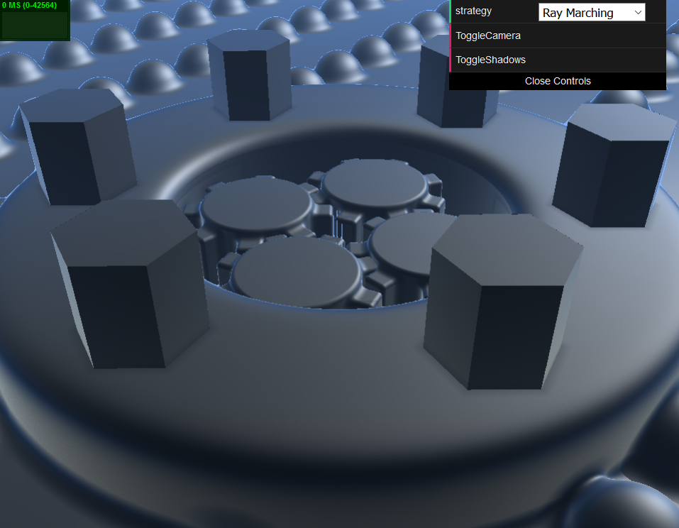
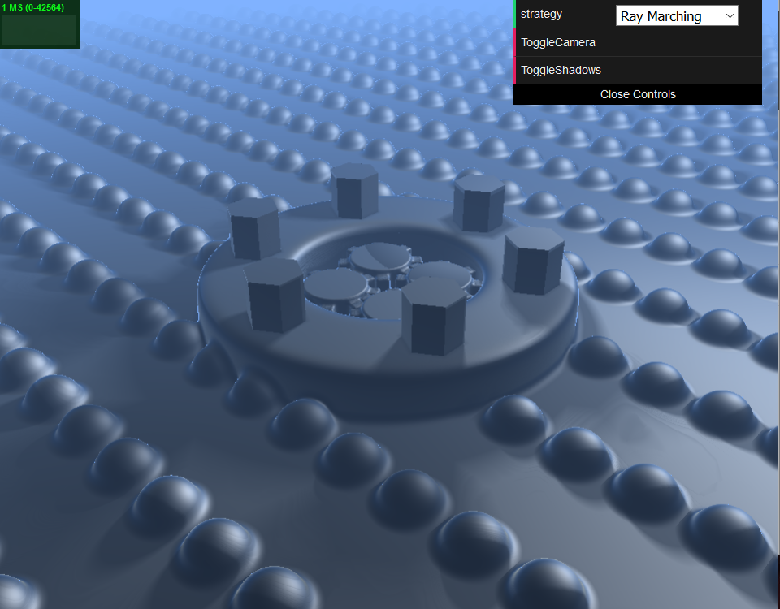

# Project 6: Implicit Surfaces

# Warning: takes time to load. Watch in Firefox, not Chrome. Reduce your window size before opening to make your computer cry less.

Due to branching, npm has a harder time compiling the shader. Once it loads, however, performance is still okay.

## [View the Demo Here](https://mccannd.github.io/Project6-RayMarching-Implicit-Surfaces/)

Notes about implementation:

-Switch between controlled and uncontrolled camera with the ToggleCamera button.
-Ambient occlusion is always active.
-Secondary shadow rays turned off by default. Activate with ToggleShadows. This uses Inigo Quilez's soft shadow approximation
-The gears are surrounded by a bounding volume, and each gear has its own volume. This greatly improves performance but has some nasty AO and shadow artifacts. 

Individual citations for methods / implementations are in the basecode